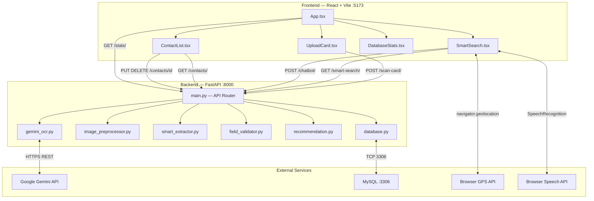
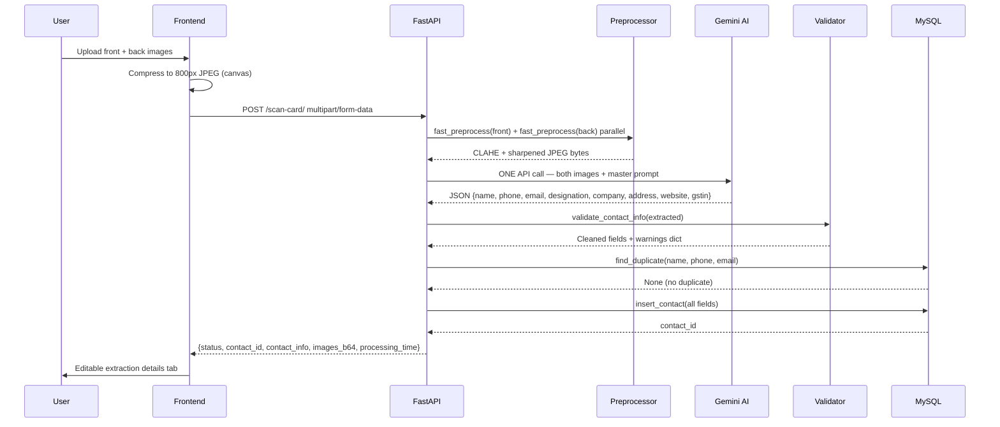
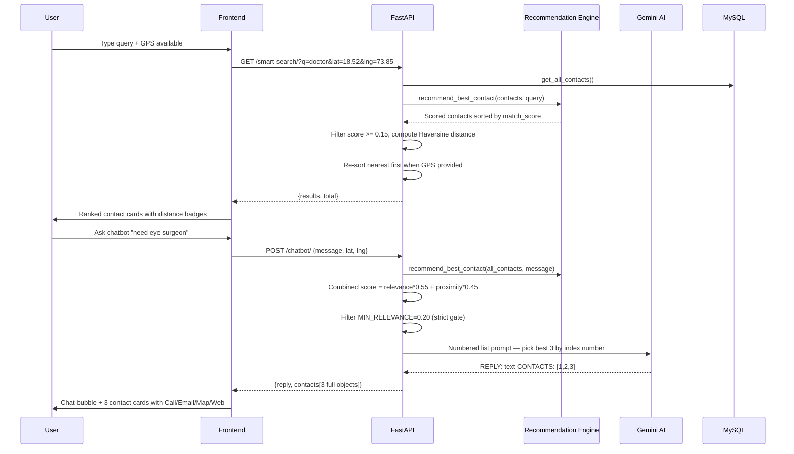

# AI Smart Card Network — Complete Technical Documentation

**Version:** 6.0.0 | **Date:** May 2026 | **Status:** Production

---

## Executive Summary

AI Smart Card Network is a full-stack AI-powered visiting card management system. It scans physical visiting cards using Google Gemini Vision AI, extracts structured contact data (name, phone, email, company, address, etc.), stores it in MySQL, and provides intelligent search with GPS-based proximity ranking, an AI chatbot assistant, and voice search. The system currently holds 250+ contacts and processes cards in 3–5 seconds.

---

## 1. Project Overview

| Field | Details |
|---|---|
| **Name** | AI Smart Card Network |
| **Purpose** | Digitize and intelligently manage visiting card contacts |
| **Primary Users** | Business professionals, sales teams, networkers |
| **Backend URL** | http://127.0.0.1:8000 |
| **Frontend URL** | http://localhost:5173 |
| **GitHub** | https://github.com/Sarthak22kar/AI-Smart-Card |
| **Database** | MySQL — `ai_smart_card` — 250+ contacts |

### Core Features

1. **Card Scanning** — Upload front+back images → Gemini AI extracts all fields in one API call
2. **Smart Search** — Fuzzy keyword search with GPS distance sorting
3. **AI Chatbot** — Natural language queries ("find me a doctor near Pune")
4. **Voice Search** — Browser Speech Recognition API (`en-IN` locale)
5. **Smart Listen** — Ambient keyword detection, auto-searches on detected words
6. **Contact Management** — Full CRUD with inline field editing
7. **CSV Import** — Bulk import from cleaned CSV files
8. **Batch OCR** — Process 50+ card images interactively with keep/skip prompts
9. **Distance Ranking** — Haversine formula with real GPS coordinates (80+ Indian cities)
10. **Stats Dashboard** — Confidence scores, profession breakdown, OCR engine stats

---

## 2. Repository Structure

```
AI_Smart_Card/
├── backend/
│   ├── main.py                  # FastAPI app — all 13 endpoints (v6)
│   ├── database.py              # MySQL pool, CRUD, duplicate detection
│   ├── gemini_ocr.py            # Google Gemini Vision AI integration
│   ├── image_preprocessor.py   # OpenCV CLAHE/sharpen/shadow pipeline
│   ├── smart_extractor.py       # Rule-based + spaCy NLP field extraction
│   ├── field_validator.py       # Phone/email/name validation & cleaning
│   ├── recommendation.py        # Keyword scoring & contact ranking engine
│   ├── card_detector.py         # Card boundary detection (contour/perspective)
│   ├── ocr.py                   # EasyOCR + Tesseract fallback engines
│   ├── config.py                # All runtime configuration flags
│   ├── cleanup_garbage.py       # Utility to remove bad DB entries
│   ├── test_accuracy.py         # OCR accuracy test suite
│   ├── view_contacts.py         # CLI contact viewer
│   ├── requirements.txt         # Python dependencies (pinned versions)
│   └── .env                     # API keys & DB credentials (gitignored)
│
├── frontend/
│   ├── src/
│   │   ├── App.tsx              # Root — 4 tabs, live contact count
│   │   ├── App.css              # Global styles
│   │   ├── main.tsx             # React entry point
│   │   └── components/
│   │       ├── SmartSearch.tsx  # Search + AI Chat + Voice + Ambient (741 lines)
│   │       ├── UploadCard.tsx   # Card scan + editable extraction (400+ lines)
│   │       ├── ContactList.tsx  # Accordion list + edit modal + delete
│   │       ├── DatabaseStats.tsx # Stats dashboard (lazy-loaded)
│   │       ├── Recommendation.tsx # Legacy recommendation UI
│   │       └── OutputBox.tsx    # Simple text output display
│   ├── package.json             # React 19, TypeScript 6, Vite 8
│   └── vite.config.ts           # Vite build config
│
├── START_BACKEND.sh             # Backend startup script
├── START_SYSTEM.sh              # Full system startup
├── STOP_SYSTEM.sh               # System shutdown
├── AI_SMART_CARD_DOCUMENTATION.md  # This file
└── *.md                         # Various guide documents
```

---

## 3. System Architecture



### Card Scan Data Flow



### Search + Chatbot Flow



---

## 4. Technology Stack

### Backend
| Technology | Version | Purpose |
|---|---|---|
| Python | 3.12 | Runtime |
| FastAPI | 0.104.1 | REST API framework |
| Uvicorn | 0.24.0 | ASGI server |
| Google Gemini AI | 2.5-flash-lite | Primary OCR + chatbot intelligence |
| EasyOCR | 1.7.0 | Fallback OCR engine |
| Tesseract | 0.3.10 | Secondary fallback OCR |
| OpenCV | 4.8.1 | Image preprocessing pipeline |
| Pillow | 10.1.0 | Image I/O and EXIF handling |
| pillow-heif | 0.13.0 | HEIC/HEIF iPhone image support |
| spaCy | 3.7.2 | NLP name entity extraction |
| mysql-connector-python | 9.6.0 | MySQL driver with connection pool |
| fuzzywuzzy | 0.18.0 | Fuzzy string matching |
| Levenshtein | 0.25.0 | Fast string distance (fuzzywuzzy dep) |
| PyTorch | 2.2.0 | EasyOCR deep learning backend |
| torchvision | 0.17.0 | EasyOCR vision models |

### Frontend
| Technology | Version | Purpose |
|---|---|---|
| React | 19.2.4 | UI framework |
| TypeScript | 6.0.2 | Type safety |
| Vite | 8.0.4 | Build tool + HMR dev server |
| Browser Speech Recognition API | Native | Voice search + ambient listen |
| Browser Geolocation API | Native | GPS coordinates for distance |

### Database
| Property | Value |
|---|---|
| Engine | MySQL 8.0 |
| Database name | `ai_smart_card` |
| Primary table | `contacts` (16 columns) |
| Secondary table | `search_history` |
| Connection pool | 5 connections |
| Charset | utf8mb4 (full Unicode) |
| Collation | utf8mb4_unicode_ci |

### Infrastructure (Local Dev)
| Component | Details |
|---|---|
| OS | macOS (darwin) |
| MySQL path | `/usr/local/mysql/` |
| Backend port | 8000 |
| Frontend port | 5173 |
| Python venv | `backend/venv/` |

---

## 5. Environment & Configuration

### `backend/.env` (never commit to git)
```ini
GEMINI_API_KEY=AIzaSy...
GEMINI_MODEL=gemini-2.5-flash-lite
MYSQL_HOST=localhost
MYSQL_PORT=3306
MYSQL_DATABASE=ai_smart_card
MYSQL_USER=root
MYSQL_PASSWORD=your_password_here
```

> **Note:** When Gemini quota is exhausted (HTTP 429), change `GEMINI_MODEL` to `gemini-1.5-flash` or wait ~1 hour for quota reset.

### `config.py` — Runtime Flags
| Flag | Default | Purpose |
|---|---|---|
| ENABLE_CARD_DETECTION | true | Auto-detect card boundaries via contour |
| CARD_DETECTION_METHOD | advanced | `advanced` = contour+perspective, `simple` = crop margins |
| MIN_CARD_AREA_PERCENT | 0.2 | Reject cards smaller than 20% of image |
| ENABLE_AUTO_ROTATE | true | Auto-rotate based on text orientation |
| ENABLE_SHADOW_REMOVAL | true | Remove shadows in full preprocessing |
| ENABLE_DENOISING | true | Denoise images for OCR |
| ENABLE_SHARPENING | true | Sharpen edges for OCR |
| ENABLE_ADAPTIVE_THRESHOLD | true | Adaptive threshold for low-contrast images |
| MIN_EXTRACTION_CONFIDENCE | 0.3 | Minimum confidence score to save contact |
| ENABLE_SPACY_NER | true | Use spaCy NER for name extraction |
| ENABLE_FIELD_VALIDATION | true | Validate phone/email/name fields |
| STRICT_VALIDATION_MODE | false | Clear invalid fields vs. try to clean them |
| MIN_PHONE_DIGITS | 10 | Indian mobile: 10 digits |
| MAX_PHONE_DIGITS | 12 | With country code: 12 digits |
| SAVE_DEBUG_IMAGES | false | Save preprocessed images to `debug_images/` |
| VERBOSE_LOGGING | true | Detailed console output |

---

## 6. Database Documentation

### Schema

```sql
-- Main contacts table
CREATE TABLE contacts (
    id                    INT AUTO_INCREMENT PRIMARY KEY,
    name                  VARCHAR(255)  NOT NULL DEFAULT '',
    phone                 VARCHAR(100)  NOT NULL DEFAULT '',
    email                 VARCHAR(255)  NOT NULL DEFAULT '',
    designation           VARCHAR(255)  NOT NULL DEFAULT '',
    company               VARCHAR(255)  NOT NULL DEFAULT '',
    address               TEXT          NOT NULL DEFAULT '',
    website               VARCHAR(255)  NOT NULL DEFAULT '',
    gstin                 VARCHAR(20)   NOT NULL DEFAULT '',
    services              VARCHAR(500)  NOT NULL DEFAULT '',
    raw_text              TEXT          NOT NULL DEFAULT '',
    extraction_confidence FLOAT         NOT NULL DEFAULT 0.0,
    ocr_engine            VARCHAR(50)   NOT NULL DEFAULT '',
    image_formats         VARCHAR(100)  NOT NULL DEFAULT '',
    validation_warnings   TEXT          NOT NULL DEFAULT '',
    created_at            DATETIME      NOT NULL DEFAULT CURRENT_TIMESTAMP,
    updated_at            DATETIME      NOT NULL DEFAULT CURRENT_TIMESTAMP
                          ON UPDATE CURRENT_TIMESTAMP,
    INDEX idx_name        (name),
    INDEX idx_phone       (phone),
    INDEX idx_email       (email),
    INDEX idx_company     (company),
    INDEX idx_confidence  (extraction_confidence DESC),
    INDEX idx_created     (created_at DESC)
);

-- Search history table
CREATE TABLE search_history (
    id         INT AUTO_INCREMENT PRIMARY KEY,
    query      VARCHAR(500),
    source     VARCHAR(50),   -- 'manual', 'voice', 'ambient', 'chatbot'
    results    INT,
    created_at DATETIME DEFAULT CURRENT_TIMESTAMP
);
```

### Confidence Scoring Algorithm
```python
_FIELD_WEIGHTS = {
    'name':        0.25,   # most critical
    'phone':       0.20,
    'email':       0.20,
    'company':     0.15,
    'designation': 0.10,
    'address':     0.05,
    'website':     0.03,
    'gstin':       0.02,
}
# confidence = sum of weights for non-empty, non-placeholder fields
# Range: 0.0 (nothing extracted) to 1.0 (all fields present)
# Stars = confidence * 5 (displayed as 0-5 star rating)
```

### Duplicate Detection Logic
```python
# Priority order:
# 1. Email match (exact, case-insensitive)
# 2. Phone match (last 10 digits)
# 3. Name match (normalized, case-insensitive)
```

### Connection Pool
```python
MySQLConnectionPool(
    pool_name="ai_card_pool",
    pool_size=5,
    charset='utf8mb4',
    collation='utf8mb4_unicode_ci',
    autocommit=False,
)
```

---

## 7. API Documentation

### Base URL: `http://127.0.0.1:8000`
### Interactive Docs: `http://127.0.0.1:8000/docs` (Swagger UI)

---

### `GET /`
Health check.
```json
{"message": "AI Smart Visiting Card API 🚀", "version": "6.0.0", "gemini": true}
```

---

### `POST /scan-card/`
Scan a visiting card and extract contact information.

**Request:** `multipart/form-data`
| Field | Type | Required |
|---|---|---|
| front_file | File | Yes |
| back_file | File | Yes |

Supported formats: JPG, PNG, HEIC, HEIF, WebP, TIFF, BMP

**Success Response:**
```json
{
  "status": "success",
  "contact_id": 201,
  "contact_info": {
    "name": "Vikrant Yadav",
    "phone": "+91 99965 59252",
    "email": "vikrant@nise.res.in",
    "designation": "Asst. Director / Scientist B",
    "company": "National Institute of Solar Energy",
    "address": "Gwal Pahar, Gurugram - 122003",
    "website": "http://www.nise.res.in",
    "gstin": ""
  },
  "ocr_engine": "gemini",
  "processing_time": {"ocr": 3.2, "validation": 0.1, "database": 0.05, "total": 3.35},
  "images": {
    "before_front": "data:image/jpeg;base64,...",
    "after_front":  "data:image/jpeg;base64,...",
    "before_back":  "data:image/jpeg;base64,...",
    "after_back":   "data:image/jpeg;base64,..."
  },
  "validation": {
    "is_valid": true,
    "errors": {},
    "warnings": {"phone": "Formatted to +91 standard"}
  }
}
```

**Duplicate Response:**
```json
{
  "status": "duplicate",
  "message": "Contact already exists",
  "existing_contact": {"id": 45, "name": "Vikrant Yadav", "phone": "+91 99965 59252", "email": "..."}
}
```

**Error Response:**
```json
{"status": "error", "message": "Could not extract contact information. Try a clearer image."}
```

---

### `GET /contacts/`
List all contacts.
```json
{
  "contacts": [
    {
      "id": 1, "name": "Sanjay Kulkarni", "phone": "+91 ...",
      "email": "...", "designation": "Certified Energy Auditor",
      "company": "...", "address": "...", "website": "...",
      "gstin": "", "services": "Solar", "extraction_confidence": 0.98,
      "created_at": "2026-04-18 09:49:39"
    }
  ],
  "total": 250
}
```

---

### `PUT /contacts/{id}`
Update contact fields.

**Request Body:** Any subset of: `name`, `phone`, `email`, `designation`, `company`, `address`, `website`, `gstin`, `services`
```json
{"name": "Corrected Name", "phone": "+91 98765 43210"}
```
**Response:**
```json
{"status": "success", "message": "Contact 45 updated", "updated": {"name": "Corrected Name"}}
```

---

### `DELETE /contacts/{id}`
Delete a contact permanently.
```json
{"status": "success", "message": "Contact 45 deleted"}
```

---

### `GET /smart-search/`
Fuzzy search with GPS-aware distance ranking.

**Query Parameters:**
| Param | Type | Default | Description |
|---|---|---|---|
| q | string | "" | Search query |
| limit | int | 10 | Max results |
| lat | float | null | User GPS latitude |
| lng | float | null | User GPS longitude |

**Response:**
```json
{
  "results": [
    {
      "id": 91, "name": "SURYA",
      "designation": "M.S.(Ophth) Consulting Eye-Surgeon",
      "company": "SURYA", "phone": "+91 ...",
      "stars": 4.8, "distance_km": 0.0, "match_score": 0.338,
      "address": "Rasta Peth, Pune"
    }
  ],
  "total": 2,
  "query": "eye surgeon"
}
```

---

### `POST /chatbot/`
AI-powered natural language contact search.

**Request:**
```json
{
  "message": "I need an eye surgeon near me",
  "lat": 18.5204,
  "lng": 73.8567
}
```

**Response:**
```json
{
  "reply": "SURYA is an M.S.(Ophth) Consulting Eye Surgeon located in Pune, making them your closest and most relevant contact for eye care.",
  "contacts": [
    {
      "id": 91, "name": "SURYA",
      "designation": "M.S.(Ophth) Consulting Eye-Surgeon",
      "phone": "+91 ...", "email": "...",
      "stars": 4.8, "distance_km": 0.0,
      "address": "Rasta Peth, Pune",
      "website": "", "services": ""
    }
  ]
}
```

---

### `POST /extract-keywords/`
Extract service keywords from spoken/typed text.

**Request:** `{"text": "I need someone to fix my AC unit"}`
**Response:** `{"keywords": ["ac repair", "air conditioning"], "search": "ac repair"}`

---

### `GET /stats/`
Database statistics.
```json
{
  "status": "success",
  "statistics": {
    "total_contacts": 250,
    "average_confidence": 0.887,
    "high_confidence": 220,
    "low_confidence": 0,
    "by_designation": {"Director": 19, "Doctor": 15, "Advocate": 12},
    "by_company": {"National Institute of Solar Energy": 4},
    "by_ocr_engine": {"easyocr": 95, "gemini": 94, "csv-import": 53},
    "recent_contacts": [...]
  }
}
```

---

## 8. OCR Pipeline — Deep Dive

### Fast Path (Gemini — ~3-5s)
```
Image Upload
    │
    ├─ fast_preprocess(front)  ──┐
    │   EXIF fix                 │
    │   Resize ≤ 1200px          ├─ Parallel (ThreadPoolExecutor)
    │   CLAHE contrast           │
    │   Sharpen                  │
    ├─ fast_preprocess(back)  ───┘
    │
    └─ gemini_extract_both_cards(front_bytes, back_bytes)
            ONE Gemini API call with master prompt
            Returns JSON with all 8 fields
            │
            ├─ _looks_like_garbage_name() → derive from email if true
            ├─ validate_contact_info()    → clean + warn
            ├─ find_duplicate()           → check DB
            └─ insert_contact()           → save
```

### Fallback Path (EasyOCR/Tesseract — ~5-8s)
```
full_preprocess()
    EXIF fix → resize → contour crop → shadow removal
    → CLAHE → sharpen → adaptive threshold if low contrast
    │
    ├─ easyocr_extract()   (primary fallback)
    └─ tesseract_extract() (secondary fallback)
            │
            └─ process_visiting_card()  (smart_extractor)
                    Rule-based regex parsing
                    spaCy NER for names
                    │
                    └─ gemini_enrich_from_text()
                            Gemini labels raw OCR text
                            if API available
```

### Image Preprocessing Comparison
| Step | Fast Path | Full Path | Purpose |
|---|---|---|---|
| EXIF rotation fix | ✅ | ✅ | Fix phone camera orientation |
| Resize ≤ 1200px | ✅ | ✅ | Reduce API payload size |
| CLAHE contrast | ✅ | ✅ | Enhance text visibility |
| Sharpen | ✅ | ✅ | Crisp edges for OCR |
| Contour card crop | ❌ | ✅ | Remove background |
| Shadow removal | ❌ | ✅ | Even lighting |
| Adaptive threshold | ❌ | ✅ | Handle low-contrast cards |
| Denoising | ❌ | ✅ | Remove noise artifacts |

### Gemini Master Prompt Strategy
- Sends **both** card images in a **single** API call (was 4 calls previously)
- Handles: rotated cards, dark backgrounds, logo-only sides, non-standard TLDs
- Returns structured JSON — no post-processing regex needed
- Falls back to index-based contact selection in chatbot (no name-matching guesswork)

---

## 9. Smart Search & Recommendation Engine

### Keyword Expansion Map (50+ categories)
```python
KEYWORD_MAP = {
    'electrician':   ['electrician', 'electrical', 'wiring', 'electric', 'power'],
    'doctor':        ['doctor', 'physician', 'medical', 'clinic', 'surgeon', 'mbbs', 'md'],
    'eye surgeon':   ['eye', 'surgeon', 'ophth', 'ophthalm', 'eye clinic', 'cataract', 'lasik'],
    'lawyer':        ['lawyer', 'advocate', 'legal', 'attorney', 'law', 'court'],
    'ca':            ['chartered accountant', 'accountant', 'audit', 'tax', 'gst'],
    'solar':         ['solar', 'renewable energy', 'solar panel', 'electrolyser'],
    'architect':     ['architect', 'architecture', 'building design'],
    # ... 40+ more categories
}
```

### Scoring Algorithm
```python
# Step 1: Relevance score per contact (0.0 - 1.0)
fields_weights = {
    'designation': 0.40,  # most important
    'services':    0.30,
    'company':     0.15,
    'name':        0.10,
    'address':     0.03,
    'email':       0.02,
}

# Match quality multipliers
full_query_match  = weight * 1.0
single_word_match = weight * 0.8
keyword_expansion = weight * 0.6

# Step 2: Proximity score (when GPS provided)
prox_score = max(0.0, 1.0 - distance_km / 2000.0)

# Step 3: Combined score
combined = relevance * 0.55 + prox_score * 0.45  # GPS mode
combined = relevance                               # no GPS

# Step 4: Strict filtering
MIN_RELEVANCE_CHATBOT = 0.20  # hard gate — no proximity override
MIN_RELEVANCE_SEARCH  = 0.15

# Step 5: City filtering (fallback when Gemini unavailable)
# If message contains city name → filter contacts to that city first
```

### Word-Boundary Matching (prevents false positives)
```python
WHOLE_WORD_ONLY = {'ms', 'md', 'dr', 'ca', 'hr', 'ac', 'it', 'ceo', 'cto', 'cfo'}

def _kw_matches(kw, text):
    if kw in WHOLE_WORD_ONLY or len(kw) <= 2:
        # Must be surrounded by non-alphanumeric chars
        return bool(re.search(r'(?<![a-z0-9])' + re.escape(kw) + r'(?![a-z0-9])', text))
    return kw in text
# Prevents: "ms" matching "ecosistems", "ca" matching "cardiac"
```

### Haversine Distance Calculation
```python
def _haversine(lat1, lng1, lat2, lng2):
    R = 6371.0  # Earth radius in km
    dlat = math.radians(lat2 - lat1)
    dlng = math.radians(lng2 - lng1)
    a = (math.sin(dlat/2)**2 +
         math.cos(math.radians(lat1)) * math.cos(math.radians(lat2)) *
         math.sin(dlng/2)**2)
    return round(R * 2 * math.asin(math.sqrt(a)), 1)

# 80+ Indian cities mapped with real GPS coordinates
# Longest city name matched first (prevents "pune" matching "navi mumbai")
```

---

## 10. Frontend Analysis

### Component Architecture
```
App.tsx
├── SmartSearch.tsx      (Search tab — default)
│   ├── ResultCard       (inline component)
│   └── Chatbot          (inline component)
├── UploadCard.tsx       (Scan Card tab)
│   └── ImageComparison  (inline component)
├── ContactList.tsx      (Contacts tab)
│   └── EditModal        (inline component)
└── DatabaseStats.tsx    (Stats tab — lazy fetch)
```

### State Management
No external state library (Redux/Zustand). Each component manages its own state with `useState` + `useEffect`. Data flows via:
- Props: `refreshTrigger` (int) from App → ContactList to trigger re-fetch
- Callbacks: `onScanSuccess()` from UploadCard → App to increment trigger
- Direct API calls: each component fetches its own data

### SmartSearch.tsx — Key State
```typescript
const [query, setQuery]         // current search text
const [results, setResults]     // search results array
const [mode, setMode]           // "search" | "chat"
const [gps, setGps]             // {lat, lng} | null
const [ambient, setAmbient]     // ambient listen active
const [messages, setMessages]   // chatbot message history
```

### Voice Features
```typescript
// Voice Search — single utterance
const r = new SpeechRecognition();
r.lang = "en-IN";
r.continuous = false;
r.onresult = (e) => { setQuery(transcript); doSearch(transcript); };

// Smart Listen — continuous ambient
r.continuous = true;
r.interimResults = true;
r.onresult = async (e) => {
    // Send to /extract-keywords/ → get service keyword → auto-search
};
r.onend = () => { if (ambientRef.current) r.start(); }; // restart loop
```

### Image Compression (Client-side)
```typescript
// Before upload: compress to 800px max, JPEG 85% quality
const canvas = document.createElement("canvas");
// Resize maintaining aspect ratio
canvas.toBlob(blob => resolve(new File([blob], name, {type: "image/jpeg"})),
              "image/jpeg", 0.85);
// HEIC/HEIF files passed through without compression (server handles)
```

### GPS Auto-Request
```typescript
// App mounts → SmartSearch mounts → immediately requests GPS
useEffect(() => { getLocation(); }, []);
// GPS coordinates passed to both /smart-search/ and /chatbot/ endpoints
```

---

## 11. Backend Analysis

### main.py — Endpoint Map
```python
GET  /                      # health check
POST /scan-card/            # main OCR pipeline
GET  /contacts/             # list all (no pagination — returns all 250+)
GET  /contacts/{id}         # single contact
PUT  /contacts/{id}         # update fields
DELETE /contacts/{id}       # delete
GET  /smart-search/         # fuzzy search + GPS ranking
POST /chatbot/              # AI chatbot with Gemini
POST /extract-keywords/     # keyword extraction for ambient listen
POST /log-search/           # log to search_history table
GET  /search-history/       # recent searches
GET  /recommend/{service}   # legacy recommendation (kept for compatibility)
GET  /stats/                # database statistics
```

### CORS Configuration
```python
app.add_middleware(
    CORSMiddleware,
    allow_origins=["*"],      # ⚠️ Should be restricted in production
    allow_credentials=True,
    allow_methods=["*"],
    allow_headers=["*"],
)
```

### Thread Pool
```python
_pool = ThreadPoolExecutor(max_workers=4)
# Used for parallel image preprocessing:
# front and back images preprocessed simultaneously
```

### Error Handling Pattern
```python
try:
    result = gemini_extract_both_cards(front, back)
except Exception as e:
    print(f"Gemini error: {e}")
    # Fall through to EasyOCR fallback
    result = easyocr_fallback(front, back)
```

### field_validator.py — Validation Rules
| Field | Rules |
|---|---|
| phone | 10 digits, starts with 6-9 (Indian mobile), strips country code |
| email | Valid format, any TLD (`.com`, `.in`, `.energy`, `.io`) |
| name | 2-5 words, no digits, not a company keyword |
| website | With or without `www`, any TLD |
| gstin | 15-char format: `\d{2}[A-Z]{5}\d{4}[A-Z][A-Z\d]Z[A-Z\d]` |

---

## 12. Batch Processing & CSV Import

### Batch OCR Script (`/Camera/batch_extract.py`)
```
Features:
- Processes all JPG/PNG in a folder
- 4s delay between cards (avoids Gemini 429)
- Auto-retry on quota: 15s → 30s → 60s → 120s backoff
- Progress saved to batch_progress.json after every card
- Resumable — re-run picks up from last processed image
- Interactive: keep / skip / edit / quit per card
- Duplicate detection before saving
```

### CSV Import Pipeline
```
data.csv (raw scraped)
    │
    clean_data.py
    │   ├── Filter: person_name must be real person (not company/service)
    │   ├── Reject: names with digits, ALL-CAPS abbreviations, company keywords
    │   ├── Validate: phone must be 10-digit Indian mobile (6-9 prefix)
    │   ├── Clean: strip unicode icons (Google Maps), format +91 XXXXX XXXXX
    │   ├── Deduplicate: by phone number
    │   └── Map columns: person_name→name, name→company, designation→services
    │
    data1.csv (53 clean contacts)
    │
    import script
        ├── database.find_duplicate() check
        └── database.insert_contact(ocr_engine='csv-import')
```

---

## 13. Security Analysis

### Current Security Posture
| Area | Status | Risk |
|---|---|---|
| Authentication | ❌ None | **Critical** — all endpoints public |
| Authorization | ❌ None | **Critical** — anyone can delete contacts |
| CORS | ⚠️ Wildcard | **High** — allows any origin |
| Rate limiting | ❌ None | **High** — API abuse possible |
| Input validation | ✅ Partial | Phone/email validated, SQL uses parameterized queries |
| SQL injection | ✅ Safe | mysql-connector uses `%s` parameterized queries |
| API key exposure | ✅ OK | In `.env`, gitignored |
| HTTPS | ❌ HTTP only | Dev only — needs TLS in production |
| Secrets in code | ✅ Clean | No hardcoded secrets found |

### SQL Injection Prevention
```python
# All queries use parameterized statements — safe
cur.execute("SELECT * FROM contacts WHERE id = %s", (contact_id,))
cur.execute("INSERT INTO contacts (name, phone...) VALUES (%s, %s...)", values)
```

---

## 14. Performance Analysis

### Bottlenecks
| Operation | Time | Notes |
|---|---|---|
| Gemini API call | 3-5s | Network + AI processing |
| EasyOCR fallback | 5-8s | PyTorch model inference |
| Image preprocessing | 0.1-0.8s | Fast/full path |
| MySQL queries | <50ms | Indexed, connection pooled |
| Smart search (250 contacts) | <100ms | In-memory scoring |

### Optimization Opportunities
1. **Pagination** — `/contacts/` returns all 250+ rows every time
2. **Search caching** — Redis cache for repeated queries
3. **Gemini response caching** — Cache by image hash for duplicate scans
4. **Lazy loading** — DatabaseStats only fetches when tab opened (already done)
5. **Image CDN** — Store card images in S3 instead of base64 in response

---

## 15. Known Issues & Technical Debt

| Issue | Severity | Fix |
|---|---|---|
| No authentication | 🔴 Critical | Add JWT middleware |
| CORS wildcard | 🔴 High | Restrict to frontend origin |
| No rate limiting | 🟡 Medium | Add slowapi or nginx rate limit |
| Frontend hardcoded `127.0.0.1:8000` | 🟡 Medium | Use `VITE_API_URL` env var |
| No pagination on `/contacts/` | 🟡 Medium | Add `?page=&limit=` params |
| Leftover SQLite files | 🟢 Low | Delete `contacts.db` in root |
| `package-lock.json` in backend/ | 🟢 Low | Delete (Node file in Python project) |
| No API integration tests | 🟡 Medium | Add pytest + httpx tests |
| No React error boundaries | 🟢 Low | Wrap components in ErrorBoundary |
| Gemini daily quota | 🟡 Medium | Implement model rotation |
| Single-word names from CSV | 🟢 Low | Acceptable for scraped data |

---

## 16. Scalability Review

### Current Limits
- **250 contacts** — in-memory scoring works fine up to ~10,000
- **Single server** — no load balancing
- **Local MySQL** — no replication
- **Gemini quota** — ~50 scans/day on free tier

### Scaling Path
```
Current (Local Dev)
    ↓
Small Scale (1-1000 users)
    - Deploy FastAPI to Railway/Render
    - MySQL → PlanetScale or AWS RDS
    - Add Redis for search caching
    - Nginx reverse proxy + rate limiting
    ↓
Medium Scale (1000-10000 users)
    - Docker + docker-compose
    - Multiple FastAPI workers (uvicorn --workers 4)
    - Elasticsearch for full-text search
    - S3 for image storage
    - JWT authentication
    ↓
Large Scale (10000+ users)
    - Kubernetes deployment
    - Horizontal pod autoscaling
    - CDN for frontend (Cloudflare)
    - Read replicas for MySQL
    - Message queue for OCR jobs (Celery + Redis)
```

---

## 17. Recommendations

### Immediate (This Week)
1. Add JWT authentication — protect all write endpoints
2. Restrict CORS to `http://localhost:5173` in dev, production domain in prod
3. Add `VITE_API_URL` env variable to frontend
4. Delete unused `contacts.db` SQLite files

### Short-term (This Month)
5. Add pagination to `/contacts/` — `?page=1&limit=20`
6. Add Redis caching for smart-search results (TTL 5 minutes)
7. Write pytest integration tests for all API endpoints
8. Add structured logging with `loguru` (replace print statements)
9. Add React ErrorBoundary components

### Long-term (Next Quarter)
10. Deploy to cloud with Docker
11. Google Maps Geocoding API for precise address→coordinates
12. Export contacts to vCard (.vcf) / CSV / Excel
13. React Native mobile app using same backend
14. Multi-user support with user accounts and contact ownership

---

## 18. Setup Guide

### Prerequisites
```
- Python 3.12+
- Node.js 18+
- MySQL 8.0+
- Tesseract OCR: brew install tesseract (macOS)
- Google Gemini API key (free tier at aistudio.google.com)
```

### Full Installation
```bash
# 1. Clone repository
git clone https://github.com/Sarthak22kar/AI-Smart-Card.git
cd AI_Smart_Card

# 2. Backend Python environment
cd backend
python3 -m venv venv
source venv/bin/activate
pip install -r requirements.txt
python3 -m spacy download en_core_web_sm

# 3. Create .env file
cat > .env << 'EOF'
GEMINI_API_KEY=your_gemini_key_here
GEMINI_MODEL=gemini-2.5-flash-lite
MYSQL_HOST=localhost
MYSQL_PORT=3306
MYSQL_DATABASE=ai_smart_card
MYSQL_USER=root
MYSQL_PASSWORD=your_mysql_password
EOF

# 4. Create MySQL database
mysql -u root -p -e "CREATE DATABASE IF NOT EXISTS ai_smart_card CHARACTER SET utf8mb4 COLLATE utf8mb4_unicode_ci;"

# 5. Frontend
cd ../frontend
npm install
```

### Running Locally (3 terminals)
```bash
# Terminal 1 — MySQL
sudo /usr/local/mysql/support-files/mysql.server start

# Terminal 2 — Backend
cd backend && source venv/bin/activate
uvicorn main:app --host 127.0.0.1 --port 8000

# Terminal 3 — Frontend
cd frontend && npm run dev
```

### Access Points
| Service | URL |
|---|---|
| Frontend App | http://localhost:5173 |
| Backend API | http://127.0.0.1:8000 |
| Swagger UI | http://127.0.0.1:8000/docs |
| ReDoc | http://127.0.0.1:8000/redoc |

---

## 19. Developer Onboarding Guide

### Understand the Project in 30 Minutes
1. **Read this doc** — especially sections 3 (Architecture) and 8 (OCR Pipeline)
2. **Open Swagger UI** at `http://127.0.0.1:8000/docs` — try the endpoints live
3. **Read `backend/main.py`** — all business logic is here (700 lines)
4. **Read `frontend/src/components/SmartSearch.tsx`** — main UI (741 lines)
5. **Scan a test card** — upload any business card image to see the full pipeline

### Key Files Priority
| Priority | File | Why |
|---|---|---|
| 1 | `backend/main.py` | All API endpoints and orchestration |
| 2 | `backend/gemini_ocr.py` | AI extraction — the core intelligence |
| 3 | `backend/recommendation.py` | Search scoring algorithm |
| 4 | `frontend/src/components/SmartSearch.tsx` | Main UI — search + chatbot |
| 5 | `frontend/src/components/UploadCard.tsx` | Card scanning UI |
| 6 | `backend/database.py` | All DB operations |
| 7 | `backend/field_validator.py` | Data cleaning rules |

### Debugging Tips
```bash
# Check backend is running
curl http://127.0.0.1:8000/

# Check contact count
curl http://127.0.0.1:8000/stats/ | python3 -m json.tool

# Test search
curl "http://127.0.0.1:8000/smart-search/?q=doctor&lat=18.52&lng=73.85"

# Test chatbot
curl -X POST http://127.0.0.1:8000/chatbot/ \
  -H "Content-Type: application/json" \
  -d '{"message":"solar energy expert","lat":18.52,"lng":73.85}'

# View contacts in terminal
source backend/venv/bin/activate && python3 backend/view_contacts.py

# Gemini 429 quota error → change model in .env:
# GEMINI_MODEL=gemini-1.5-flash
```

---

## 20. Future Roadmap

| Priority | Feature | Effort | Impact |
|---|---|---|---|
| 🔴 High | JWT authentication + user accounts | Medium | Security |
| 🔴 High | Production cloud deployment (Docker) | Medium | Availability |
| 🔴 High | Pagination for /contacts/ | Low | Performance |
| 🟡 Medium | Google Maps Geocoding API | Low | Accuracy |
| 🟡 Medium | Export to vCard/CSV/Excel | Low | Usability |
| 🟡 Medium | Contact tags and categories | Low | Organization |
| 🟡 Medium | Redis search caching | Medium | Performance |
| 🟢 Low | React Native mobile app | High | Reach |
| 🟢 Low | WhatsApp contact sharing | Medium | Usability |
| 🟢 Low | Analytics dashboard | Medium | Insights |
| 🟢 Low | Bulk delete/export | Low | Management |

---

## 21. Appendix

### Important Commands
```bash
# Start MySQL
sudo /usr/local/mysql/support-files/mysql.server start

# Start backend
cd backend && source venv/bin/activate && uvicorn main:app --host 127.0.0.1 --port 8000

# Start frontend
cd frontend && npm run dev

# Run OCR accuracy tests
source backend/venv/bin/activate && python3 backend/test_accuracy.py

# Batch process card images
source backend/venv/bin/activate && python3 /path/to/batch_extract.py

# View all contacts in terminal
source backend/venv/bin/activate && python3 backend/view_contacts.py

# Build frontend for production
cd frontend && npm run build

# Check backend logs
tail -f backend/server.log
```

### Glossary
| Term | Meaning |
|---|---|
| OCR | Optical Character Recognition — reading text from images |
| Gemini | Google multimodal AI model (vision + language) |
| CLAHE | Contrast Limited Adaptive Histogram Equalization |
| Haversine | Formula to calculate great-circle distance between GPS coordinates |
| Confidence Score | 0–1 score based on how many contact fields were extracted |
| Stars | Confidence × 5, displayed as 0–5 star rating |
| Smart Listen | Continuous ambient microphone mode that auto-searches keywords |
| Batch OCR | Interactive processing of 50+ card images with keep/skip prompts |
| CSV Import | Bulk contact import from cleaned spreadsheet data |
| Fast Path | Gemini-based OCR pipeline (~3-5s) |
| Full Path | EasyOCR/Tesseract fallback pipeline (~5-8s) |
| Combined Score | relevance × 0.55 + proximity × 0.45 for GPS-aware ranking |

---

*Generated: May 2026 | AI Smart Card Network v6.0.0 | 250+ contacts | FastAPI + React + MySQL + Gemini AI*
